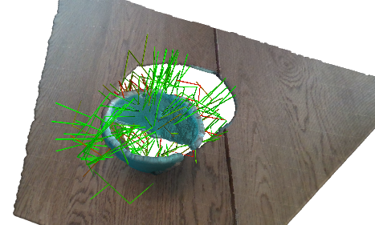
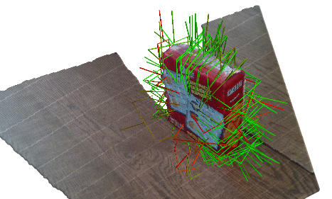

# 6-DoF GraspNet: Variational Grasp Generation for Object Manipulation

This is a PyTorch implementation of [6-DoF
GraspNet](https://arxiv.org/abs/1905.10520). The original Tensorflow
implementation is found here <https://github.com/NVlabs/6dof-graspnet>.

# License

The source code is released under [MIT License](LICENSE) and the trained weights are released under [CC-BY-NC-SA 2.0](TRAINED_MODEL_LICENSE).

## Installation

This code has been tested with python 3.6, PyTorch 1.4 and CUDA 10.0 on Ubuntu 18.04.

1) pip3 install torch==1.4.0+cu100 torchvision==0.5.0+cu100 -f https://download.pytorch.org/whl/torch_stable.html

2) Clone this repository: `git lfs clone git@github.com:jsll/pytorch_6dof-graspnet.git`. Note the `lfs` in the command to make sure that the pre-trained models are cloned properly.

3) Clone pointnet++: `git@github.com:erikwijmans/Pointnet2_PyTorch.git`.

4) Run `pip3 install -r Pointnet2_PyTorch\requirements.txt`

5) `cd pytorch_6dof-graspnet`

6) Run `pip3 install -r requirements.txt` to install necessary python libraries.

7) (optional) For multi-gpu training only: Install horovod and MPI from [here](https://github.com/horovod/horovod). We used single-gpu training for training VAE and 8-gpu training for the evaluator network.

8) Download the checkpoints to the `checkpoints` folder. Trained checkpoints are released under [CC-BY-NC-SA 2.0](TRAINED_MODEL_LICENSE) and can be downloaded from [here](https://drive.google.com/drive/folders/1mVX2kqXg9BZ22y3HEyqta20tiQrL8OK_?usp=sharing).

## Demo

Run the demo using the command below. In the paper, we only used gradient-based refinement. We also experimented with Metropolis-Hastings sampling and found it giving better results in shorter time.
As a result, we keep Metropolis-Hastings sampling as the default for the demo.

We added a gan formulation which improves the sampling quality. See details in
the [paper](https://arxiv.org/abs/1905.10520).Command for running the demo:

```shell
python -m demo.main # metropolis hasting sampling refinement. Optimal default setting for comparison with other methods.
```

Per default, the demo script runs the GAN sampler with sampling based
refinement. To run it with the VAE sampler and gradient refinement run:

```shell
python -m demo.main --grasp_sampler_folder checkpoints/vae_pretrained/ --refinement_method gradient
```

 

## Dataset

### Get ShapeNet Models

Download the meshes with ids written in [shapenet_ids.txt](shapenet_ids.txt) from <https://www.shapenet.org/.> Some of the objects are in `ShapenetCore` and `ShapenetSem`.

### Prepare ShapeNet Models

1. Clone and build: <https://github.com/hjwdzh/Manifold>
2. Create a watertight mesh version assuming the object path is model.obj: `manifold model.obj temp.watertight.obj -s`
3. Simplify it: `simplify -i temp.watertight.obj -o model.obj -m -r 0.02`

### Download the dataset

The dataset can be downloaded from [here](https://drive.google.com/open?id=1GkFrkvpP-R1letnv6rt_WLSX80o43Jjm). The dataset has 3 folders:

1) `grasps` folder: contains all the grasps for each object.
2) `meshes` folder: has the folder for all the meshes used. Except `cylinder` and `box` the rest of the folders are empty and need to be populated by the downloaded meshes from shapenet.
3) `splits` folder: contains the train/test split for each of the categories.

Verify the dataset by running `python grasp_data_reader.py` to visualize the evaluator data and `python grasp_data_reader.py --vae-mode` to visualize only the positive grasps.

## Training

To train the grasp sampler (vae or gan) or the evaluator with bare minimum configurations run:

```shell
python3 train.py  --arch {vae,gan,evaluator}  --dataset_root_folder $DATASET_ROOT_FOLDER
```

where the `$DATASET_ROOT_FOLDER` is the path to the dataset you downloaded.

For more training options run
GAN Training Example Command:

```shell
python3 train.py  --help
```

## Quantitative Evaluation

I have not converted the code for doing quantitative evaluation
<https://github.com/NVlabs/6dof-graspnet/blob/master/eval.py> to PyTorch. I
would appreciate it if someone could convert it and send in a pull request.

## Citation

If you find our work useful in your research, please consider citing:

```
inproceedings{mousavian2019graspnet,
  title={6-DOF GraspNet: Variational Grasp Generation for Object Manipulation},
  author={Arsalan Mousavian and Clemens Eppner and Dieter Fox},
  booktitle={International Conference on Computer Vision (ICCV)},
  year={2019}
}
```
